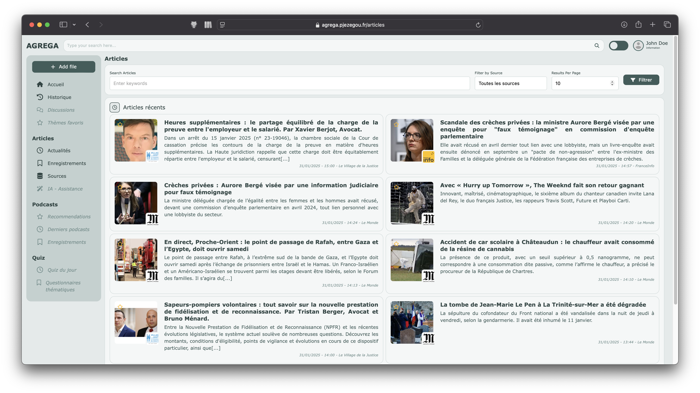

# ⛰️ AGREGA
This project centralizes and synthesizes information from various sources to help users stay informed and up-to-date for academic competitions or exams. It consolidates relevant news, podcasts into one platform, streamlining the preparation process. 🚀
> [!IMPORTANT]  
> The application is **undergoing a complete redesign** with a microservices architecture (pushed to the extreme to test concepts), with new features (summarize articles, generate quizzes...), and deployment is planned on Kubernetes.
## 🎯 Purpose
This is **primarily an educational project** designed to help understand the full lifecycle of a web application – from development to deployment in a production environment. The goal is to explore modern technologies, microservices architecture, and best practices in building scalable, real-world platforms. 🌱 It's an exciting opportunity to dive into how different components of a web application interact and come together to create something functional and impactful! 💻

## 📝 Features
- Aggregates content from multiple sources 📰
- Provides up-to-date news and updates 🔄
- Centralized platform for efficient preparation 🎓

## 📲 Installation
Instructions for installing the project will be added soon! ⏳

## 📚 Documentation
The documentation is currently under construction. Please stay tuned for detailed guides on setup, usage, and features. 🛠️
